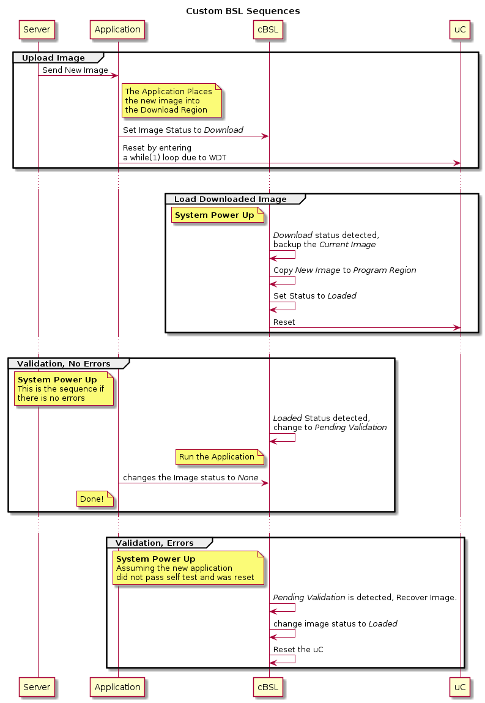

# MSP430-OTP

MSP430f5xxx Over The Air Programming.

# Notice

This code does not yet work, I am looking for contributors.  If you would like to help, please communicate with me via issues.

## Revisions

### v0.0.1
Compiler: TI v4.3.5 2/26/2015
1. Sorted out the lnk_msp430f5335.cmd
2. Removed Files that may not be needed
3. System can now compile

### v0.0.0
Compiler: TI v4.3.5 2/25/2015
Initial Commit

## Requirements:

Code Composer Studio V6+ (CCS6) and msp430f5xxx uC

## Terminology

**cBSL** Custom BSL, resides in Z area of the MSP430 Memory, this section is persistent and does not get updated.

**Application** Application code, resides in FLASH and FLASH2 area.  The application code gets updated.

**BSL** Bootstrap loader

**Current Image** Image that is currently running

**New Image** Downloaded image ready for deployment

**Program Region** Flash memory region where the current running application resides

**Backup Region** Flash memory region where backup of the Program Region is located

**Download Region** Flash memory region to where new Application is written.

**Image Status** can be one of the following:

1. *None* - No activity, nothing to be done
2. *Download* - New Image in Download Area
3. *Loaded* - The new Image has been loaded
4. *Pending Validation* - Waiting to be validated by application.
5. *Recovered* - Image Recovered from Backup region

## Usage

1. Clone the directory into you project.
2. Adjust the lnk_msp430f5xxx.cmd file.
3. Add OTP and Production build configuration to CCS6

## Concept

This BSL will be part of the project, this way the production has to flash the uC only once.  There project will have two build configurations:

1. *OTP* - Will produce the hex just the Application the BSL, Server will upload this hex over the air.
2. *Production* - Will produce hex with BSL and Application for production flashing.

Below is the initial cut of the sequence:

